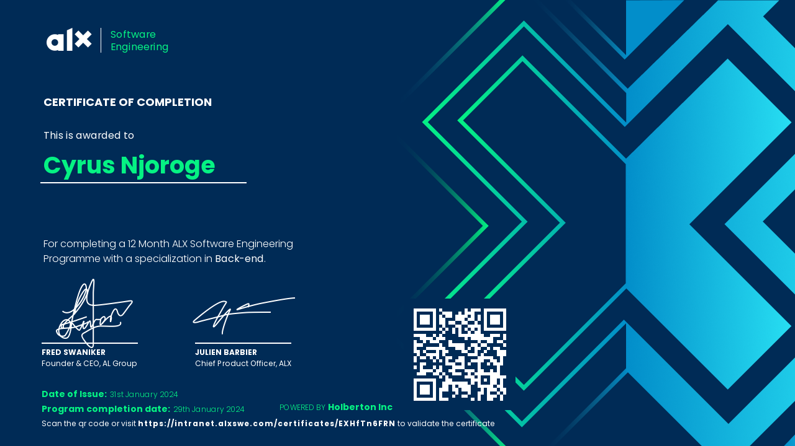

<h1 align="center">Hi 👋, I am Cyrus Chege</h1>

<h2 align="center">About Me</h2>

  
   
   I am a software engineer with a background in backend development and expertise in DevOps practices. Proficient in crafting robust backend solutions and automating deployments using CI/CD pipelines and cloud services, I am motivated to apply my knowledge to solve complex problems and am always open to learning from others.

<h2 align="center">My ALX software engineering Certificate</h2>

  

- 📫 How to reach me: [LinkedIn](https://www.linkedin.com/in/cyrus-chege-005775243/)
- 📫 How to reach me: [Email](cyruschegecc@gmail.com)

⚡ Fun fact: I love playing chess when I am not coding.

